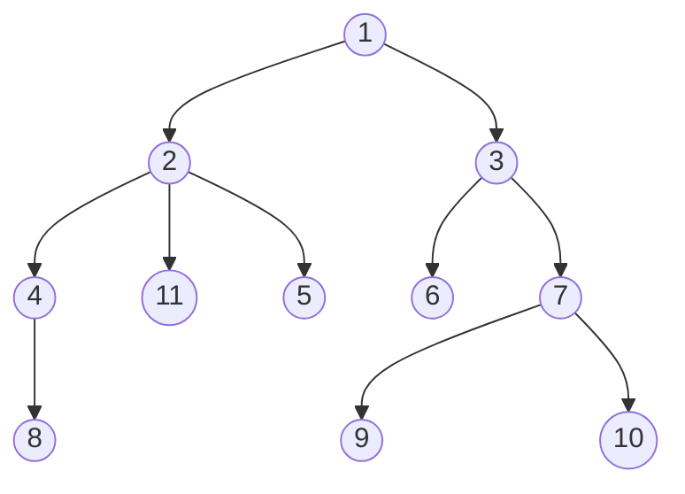

## updateChildren && patchVnode

- 
- 

## data-> view

- createElm
- removeVnodes
- addVnodes
- setTextContent

```Mermaid
graph TB

id1["_update"] --> print2["__patch"]
print2 --> print3["patch"]
print3 --> print4["patchVnode"]
print4 --> print5["updateChildren"]

print4 --> view2("patchRealDom")
view2 --> print4


print5 -->view("patchRealDom")
view --> print5
print5 --> print3["patch"]

```

### Vnode

```js
export default class VNode {
  tag: string | void
  data: VNodeData | void
  children: ?Array<VNode>
  text: string | void
  elm: Node | void
  ns: string | void
  context: Component | void // rendered in this component's scope
  key: string | number | void
  componentOptions: VNodeComponentOptions | void
  componentInstance: Component | void // component instance
  parent: VNode | void // component placeholder node

  // strictly internal
  raw: boolean // contains raw HTML? (server only)
  isStatic: boolean // hoisted static node
  isRootInsert: boolean // necessary for enter transition check
  isComment: boolean // empty comment placeholder?
  isCloned: boolean // is a cloned node?
  isOnce: boolean // is a v-once node?
  asyncFactory: Function | void // async component factory function
  asyncMeta: Object | void
  isAsyncPlaceholder: boolean
  ssrContext: Object | void
  fnContext: Component | void // real context vm for functional nodes
  fnOptions: ?ComponentOptions // for SSR caching
  devtoolsMeta: ?Object // used to store functional render context for devtools
  fnScopeId: ?string // functional scope id support

  constructor(
    tag?: string,
    data?: VNodeData,
    children?: ?Array<VNode>,
    text?: string,
    elm?: Node,
    context?: Component,
    componentOptions?: VNodeComponentOptions,
    asyncFactory?: Function
  ) {
    this.tag = tag
    this.data = data
    this.children = children
    this.text = text
    this.elm = elm
    this.ns = undefined
    this.context = context
    this.fnContext = undefined
    this.fnOptions = undefined
    this.fnScopeId = undefined
    this.key = data && data.key
    this.componentOptions = componentOptions
    this.componentInstance = undefined
    this.parent = undefined
    this.raw = false
    this.isStatic = false
    this.isRootInsert = true
    this.isComment = false
    this.isCloned = false
    this.isOnce = false
    this.asyncFactory = asyncFactory
    this.asyncMeta = undefined
    this.isAsyncPlaceholder = false
  }

  // DEPRECATED: alias for componentInstance for backwards compat.
  /* istanbul ignore next */
  get child(): Component | void {
    return this.componentInstance
  }
}
```

### 遍历算法



- DFS 深度优先遍历(Depth First Search)

  > 栈
  > 1 2 4 8 11 5 3 6 7 9 10

- BFS 广度优先遍历(Breath First Search)

  > 队列
  > 1 2 3 4 11 5 6 7 8 9 10

- 二叉樹
  - 先序
  - 中序
  - 后序

### patch()

```js
return function patch(oldVnode, vnode, hydrating, removeOnly) {
  if (isUndef(vnode)) {
    /*vnode不存在则直接调用销毁钩子*/
    if (isDef(oldVnode)) invokeDestroyHook(oldVnode)
    return
  }

  let isInitialPatch = false
  const insertedVnodeQueue = []

  if (isUndef(oldVnode)) {
    // root
    // empty mount (likely as component), create new root element
    isInitialPatch = true
    createElm(vnode, insertedVnodeQueue)
  } else {
    /*标记旧的VNode是否有nodeType*/
    const isRealElement = isDef(oldVnode.nodeType)
    if (!isRealElement && sameVnode(oldVnode, vnode)) {
      // patch existing root node
      // 是同一个节点  深入比较替换
      patchVnode(oldVnode, vnode, insertedVnodeQueue, null, null, removeOnly)
    } else {
      if (isRealElement) {
        // mounting to a real element
        // check if this is server-rendered content and if we can perform
        // a successful hydration.
        if (oldVnode.nodeType === 1 && oldVnode.hasAttribute(SSR_ATTR)) {
          oldVnode.removeAttribute(SSR_ATTR)
          hydrating = true
        }
        if (isTrue(hydrating)) {
          if (hydrate(oldVnode, vnode, insertedVnodeQueue)) {
            invokeInsertHook(vnode, insertedVnodeQueue, true)
            return oldVnode
          } else if (process.env.NODE_ENV !== 'production') {
            warn(
              'The client-side rendered virtual DOM tree is not matching ' +
                'server-rendered content. This is likely caused by incorrect ' +
                'HTML markup, for example nesting block-level elements inside ' +
                '<p>, or missing <tbody>. Bailing hydration and performing ' +
                'full client-side render.'
            )
          }
        }
        // either not server-rendered, or hydration failed.
        // create an empty node and replace it
        // 合并到真实DOM失败，则创建一个空的VNode节点替换它
        oldVnode = emptyNodeAt(oldVnode)
      }

      // replacing existing element
      // 真实目标dom
      const oldElm = oldVnode.elm
      const parentElm = nodeOps.parentNode(oldElm)

      // create new node
      createElm(
        vnode,
        insertedVnodeQueue,
        // extremely rare edge case: do not insert if old element is in a
        // leaving transition. Only happens when combining transition +
        // keep-alive + HOCs. (#4590)
        oldElm._leaveCb ? null : parentElm,
        nodeOps.nextSibling(oldElm)
      )

      // update parent placeholder node element, recursively
      if (isDef(vnode.parent)) {
        let ancestor = vnode.parent
        const patchable = isPatchable(vnode)
        while (ancestor) {
          for (let i = 0; i < cbs.destroy.length; ++i) {
            cbs.destroy[i](ancestor)
          }
          ancestor.elm = vnode.elm
          if (patchable) {
            for (let i = 0; i < cbs.create.length; ++i) {
              cbs.create[i](emptyNode, ancestor)
            }
            // #6513
            // invoke insert hooks that may have been merged by create hooks.
            // e.g. for directives that uses the "inserted" hook.
            const insert = ancestor.data.hook.insert
            if (insert.merged) {
              // start at index 1 to avoid re-invoking component mounted hook
              for (let i = 1; i < insert.fns.length; i++) {
                insert.fns[i]()
              }
            }
          } else {
            registerRef(ancestor)
          }
          ancestor = ancestor.parent
        }
      }

      // destroy old node
      if (isDef(parentElm)) {
        removeVnodes([oldVnode], 0, 0)
      } else if (isDef(oldVnode.tag)) {
        invokeDestroyHook(oldVnode)
      }
    }
  }

  invokeInsertHook(vnode, insertedVnodeQueue, isInitialPatch)
  return vnode.elm
}
```

### patchVnode()

```js
function patchVnode(oldVnode, vnode, insertedVnodeQueue, ownerArray, index, removeOnly) {
  //  Same memory address
  if (oldVnode === vnode) {
    return
  }

  if (isDef(vnode.elm) && isDef(ownerArray)) {
    // clone reused vnode
    vnode = ownerArray[index] = cloneVNode(vnode)
  }

  const elm = (vnode.elm = oldVnode.elm)

  if (isTrue(oldVnode.isAsyncPlaceholder)) {
    if (isDef(vnode.asyncFactory.resolved)) {
      hydrate(oldVnode.elm, vnode, insertedVnodeQueue)
    } else {
      vnode.isAsyncPlaceholder = true
    }
    return
  }

  // reuse element for static trees.
  // note we only do this if the vnode is cloned -
  // if the new node is not cloned it means the render functions have been
  // reset by the hot-reload-api and we need to do a proper re-render.
  if (isTrue(vnode.isStatic) && isTrue(oldVnode.isStatic) && vnode.key === oldVnode.key && (isTrue(vnode.isCloned) || isTrue(vnode.isOnce))) {
    vnode.componentInstance = oldVnode.componentInstance
    return
  }

  let i
  const data = vnode.data
  if (isDef(data) && isDef((i = data.hook)) && isDef((i = i.prepatch))) {
    i(oldVnode, vnode)
  }

  const oldCh = oldVnode.children
  const ch = vnode.children
  if (isDef(data) && isPatchable(vnode)) {
    for (i = 0; i < cbs.update.length; ++i) cbs.update[i](oldVnode, vnode)
    if (isDef((i = data.hook)) && isDef((i = i.update))) {
      i(oldVnode, vnode)
    }
  }
  if (isUndef(vnode.text)) {
    // no text
    if (isDef(oldCh) && isDef(ch)) {
      // both has children    dps   || true  && true
      if (oldCh !== ch) updateChildren(elm, oldCh, ch, insertedVnodeQueue, removeOnly)
    } else if (isDef(ch)) {
      // node has child
      if (process.env.NODE_ENV !== 'production') {
        checkDuplicateKeys(ch)
      }
      if (isDef(oldVnode.text)) nodeOps.setTextContent(elm, '') // if old has text  ,we set it as ''
      addVnodes(elm, null, ch, 0, ch.length - 1, insertedVnodeQueue) // add Vnode children node
    } else if (isDef(oldCh)) {
      //oldVnode  has children and delete it
      removeVnodes(oldCh, 0, oldCh.length - 1)
    } else if (isDef(oldVnode.text)) {
      nodeOps.setTextContent(elm, '') // TODO 566
    }
  } else if (oldVnode.text !== vnode.text) {
    // Replace content
    nodeOps.setTextContent(elm, vnode.text)
  }
  if (isDef(data)) {
    if (isDef((i = data.hook)) && isDef((i = i.postpatch))) i(oldVnode, vnode)
  }
}
```

### sameVnode()

```js
function sameVnode(a, b) {
  return (
    a.key === b.key &&
    ((a.tag === b.tag && a.isComment === b.isComment && isDef(a.data) === isDef(b.data) && sameInputType(a, b)) ||
      (isTrue(a.isAsyncPlaceholder) && //是否异步的预赋值
        a.asyncFactory === b.asyncFactory && // 异步组件的工厂方法
        isUndef(b.asyncFactory.error)))
  )
}
```

### updateChildren

> 双端比较算法，两个 Vnode 数组
> 找出差异的同时，完成需要修改的 dom 视图操作

```js
function updateChildren(parentElm, oldCh, newCh, insertedVnodeQueue, removeOnly) {
  let oldStartIdx = 0
  let newStartIdx = 0
  let oldEndIdx = oldCh.length - 1
  let oldStartVnode = oldCh[0]
  let oldEndVnode = oldCh[oldEndIdx]
  let newEndIdx = newCh.length - 1
  let newStartVnode = newCh[0]
  let newEndVnode = newCh[newEndIdx]
  let oldKeyToIdx, idxInOld, vnodeToMove, refElm

  // removeOnly is a special flag used only by <transition-group>
  // to ensure removed elements stay in correct relative positions
  // during leaving transitions
  const canMove = !removeOnly

  // debugger
  if (process.env.NODE_ENV !== 'production') {
    checkDuplicateKeys(newCh)
  }

  while (oldStartIdx <= oldEndIdx && newStartIdx <= newEndIdx) {
    if (isUndef(oldStartVnode)) {
      oldStartVnode = oldCh[++oldStartIdx] // Vnode has been moved left
    } else if (isUndef(oldEndVnode)) {
      oldEndVnode = oldCh[--oldEndIdx]
    } else if (sameVnode(oldStartVnode, newStartVnode)) {
      patchVnode(oldStartVnode, newStartVnode, insertedVnodeQueue, newCh, newStartIdx)
      oldStartVnode = oldCh[++oldStartIdx]
      newStartVnode = newCh[++newStartIdx]
    } else if (sameVnode(oldEndVnode, newEndVnode)) {
      patchVnode(oldEndVnode, newEndVnode, insertedVnodeQueue, newCh, newEndIdx)
      oldEndVnode = oldCh[--oldEndIdx]
      newEndVnode = newCh[--newEndIdx]
    } else if (sameVnode(oldStartVnode, newEndVnode)) {
      // Vnode moved right SO real dom move right
      patchVnode(oldStartVnode, newEndVnode, insertedVnodeQueue, newCh, newEndIdx)
      canMove && nodeOps.insertBefore(parentElm, oldStartVnode.elm, nodeOps.nextSibling(oldEndVnode.elm)) // move real dom
      oldStartVnode = oldCh[++oldStartIdx]
      newEndVnode = newCh[--newEndIdx]
    } else if (sameVnode(oldEndVnode, newStartVnode)) {
      // Vnode moved left
      patchVnode(oldEndVnode, newStartVnode, insertedVnodeQueue, newCh, newStartIdx)
      canMove && nodeOps.insertBefore(parentElm, oldEndVnode.elm, oldStartVnode.elm) // move real dom
      oldEndVnode = oldCh[--oldEndIdx]
      newStartVnode = newCh[++newStartIdx]
    } else {
      // [1,2,3]
      if (isUndef(oldKeyToIdx)) oldKeyToIdx = createKeyToOldIdx(oldCh, oldStartIdx, oldEndIdx) //    old    {  1: 0  ,  2:1  , 3:2}

      idxInOld = isDef(newStartVnode.key) ? oldKeyToIdx[newStartVnode.key] : findIdxInOld(newStartVnode, oldCh, oldStartIdx, oldEndIdx)

      if (isUndef(idxInOld)) {
        // New element
        //  [2]
        //  [3]
        createElm(newStartVnode, insertedVnodeQueue, parentElm, oldStartVnode.elm, false, newCh, newStartIdx)
      } else {
        // different index
        //  [5,2,3,6],
        //  [4,3,2,1]
        vnodeToMove = oldCh[idxInOld]
        if (sameVnode(vnodeToMove, newStartVnode)) {
          patchVnode(vnodeToMove, newStartVnode, insertedVnodeQueue, newCh, newStartIdx)
          oldCh[idxInOld] = undefined
          canMove && nodeOps.insertBefore(parentElm, vnodeToMove.elm, oldStartVnode.elm)
        } else {
          // same key but different element. treat as new element
          //   old  li  key =3
          //   now   div key = 3
          createElm(newStartVnode, insertedVnodeQueue, parentElm, oldStartVnode.elm, false, newCh, newStartIdx)
        }
      }
      newStartVnode = newCh[++newStartIdx]
    }
  }
  if (oldStartIdx > oldEndIdx) {
    //  [1，2]
    //  [4,2,1,3]
    refElm = isUndef(newCh[newEndIdx + 1]) ? null : newCh[newEndIdx + 1].elm
    addVnodes(parentElm, refElm, newCh, newStartIdx, newEndIdx, insertedVnodeQueue) // dom
  } else if (newStartIdx > newEndIdx) {
    removeVnodes(oldCh, oldStartIdx, oldEndIdx) // remove real dom
  }
}
```

## exapmple

### example1

```Mermaid
graph TB
 E>old]
 C((1))
 d((''))
 f((''))
```

```Mermaid
graph TB
 E>new]
 C((1))
 d((''))
 g((''))
```

### example2

```Mermaid

graph TB
 E>old]
 C((''))
 f((''))
 e((2))
```

```Mermaid
graph TB
 E>new]
 C((''))
 d((''))
 g((2))
```

### example3

```Mermaid
graph TB
 E>old]
 C((1))
 f((''))
 e((''))
```

```Mermaid
graph TB
 E>new]
 C((''))
 d((''))
 g((1))
```

### example4

```Mermaid
graph TB
 E>old]
 C((''))
 d((''))
 e((1))
```

```Mermaid
graph TB
 E>new]
 C((1))
 d((''))
 g((''))
```

### example5

```Mermaid
graph TB
 E>old]
 e((1))
```

```Mermaid
graph TB
 E>new]
 C((2))
```

- 比较前


- patch 之后

- 

## dom 操作

### addVnodes

```js
function addVnodes(parentElm, refElm, vnodes, startIdx, endIdx, insertedVnodeQueue) {
  for (; startIdx <= endIdx; ++startIdx) {
    createElm(vnodes[startIdx], insertedVnodeQueue, parentElm, refElm, false, vnodes, startIdx)
  }
}
```

### createElm

```js
function createElm(vnode, insertedVnodeQueue, parentElm, refElm, nested, ownerArray, index) {
  if (isDef(vnode.elm) && isDef(ownerArray)) {
    // This vnode was used in a previous render!
    // now it's used as a new node, overwriting its elm would cause
    // potential patch errors down the road when it's used as an insertion
    // reference node. Instead, we clone the node on-demand before creating
    // associated DOM element for it.
    vnode = ownerArray[index] = cloneVNode(vnode)
  }

  vnode.isRootInsert = !nested // for transition enter check
  if (createComponent(vnode, insertedVnodeQueue, parentElm, refElm)) {
    return
  }

  const data = vnode.data
  const children = vnode.children
  const tag = vnode.tag
  if (isDef(tag)) {
    if (process.env.NODE_ENV !== 'production') {
      if (data && data.pre) {
        creatingElmInVPre++
      }
      if (isUnknownElement(vnode, creatingElmInVPre)) {
        warn(
          'Unknown custom element: <' +
            tag +
            '> - did you ' +
            'register the component correctly? For recursive components, ' +
            'make sure to provide the "name" option.',
          vnode.context
        )
      }
    }

    vnode.elm = vnode.ns ? nodeOps.createElementNS(vnode.ns, tag) : nodeOps.createElement(tag, vnode)
    setScope(vnode)

    /* istanbul ignore if */
    if (__WEEX__) {
      // in Weex, the default insertion order is parent-first.
      // List items can be optimized to use children-first insertion
      // with append="tree".
      const appendAsTree = isDef(data) && isTrue(data.appendAsTree)
      if (!appendAsTree) {
        if (isDef(data)) {
          invokeCreateHooks(vnode, insertedVnodeQueue)
        }
        insert(parentElm, vnode.elm, refElm)
      }
      createChildren(vnode, children, insertedVnodeQueue)
      if (appendAsTree) {
        if (isDef(data)) {
          invokeCreateHooks(vnode, insertedVnodeQueue)
        }
        insert(parentElm, vnode.elm, refElm)
      }
    } else {
      createChildren(vnode, children, insertedVnodeQueue)
      if (isDef(data)) {
        invokeCreateHooks(vnode, insertedVnodeQueue)
      }
      insert(parentElm, vnode.elm, refElm)
    }

    if (process.env.NODE_ENV !== 'production' && data && data.pre) {
      creatingElmInVPre--
    }
  } else if (isTrue(vnode.isComment)) {
    vnode.elm = nodeOps.createComment(vnode.text)
    insert(parentElm, vnode.elm, refElm)
  } else {
    vnode.elm = nodeOps.createTextNode(vnode.text)
    insert(parentElm, vnode.elm, refElm)
  }
}
```

### removeVnodes

```js
function removeVnodes(vnodes, startIdx, endIdx) {
  for (; startIdx <= endIdx; ++startIdx) {
    const ch = vnodes[startIdx]
    if (isDef(ch)) {
      if (isDef(ch.tag)) {
        removeAndInvokeRemoveHook(ch)
        invokeDestroyHook(ch)
      } else {
        // Text node
        removeNode(ch.elm)
      }
    }
  }
}
```

### domApi

- 
